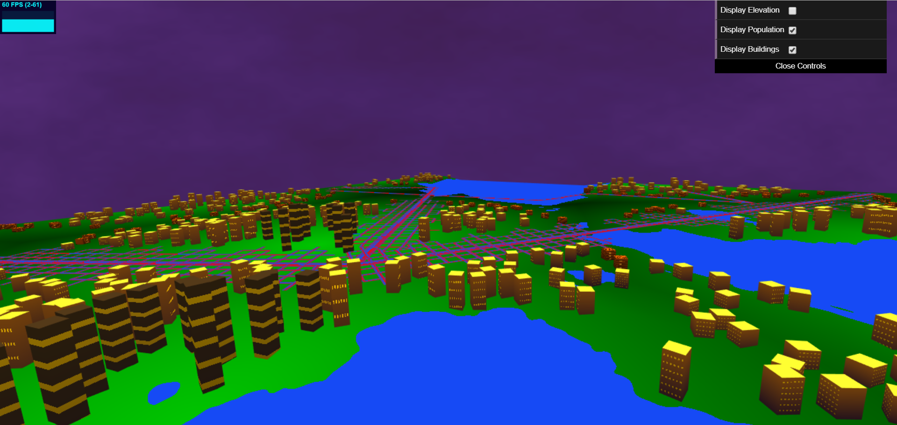
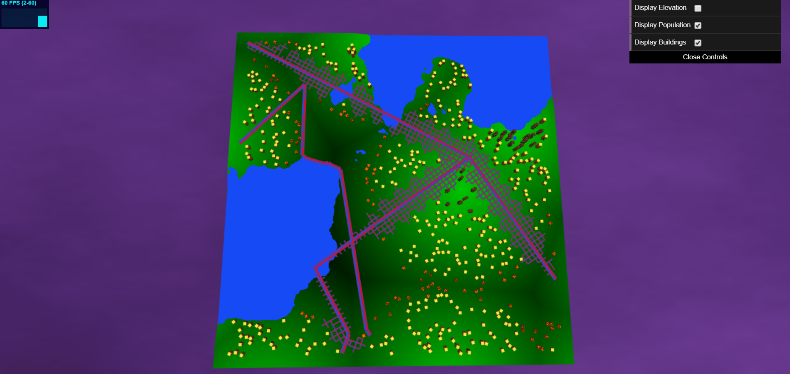
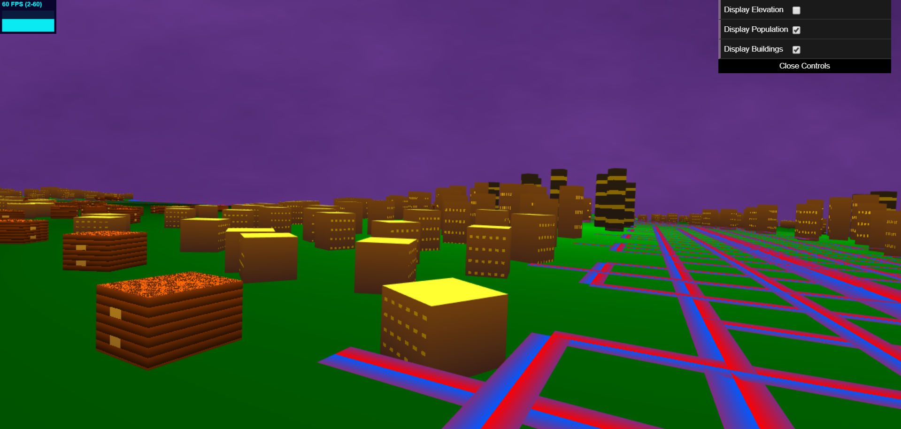
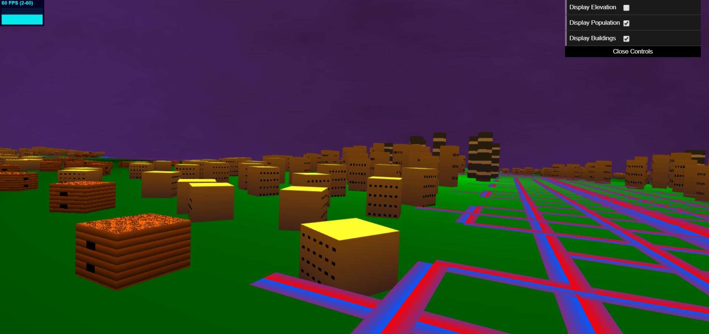
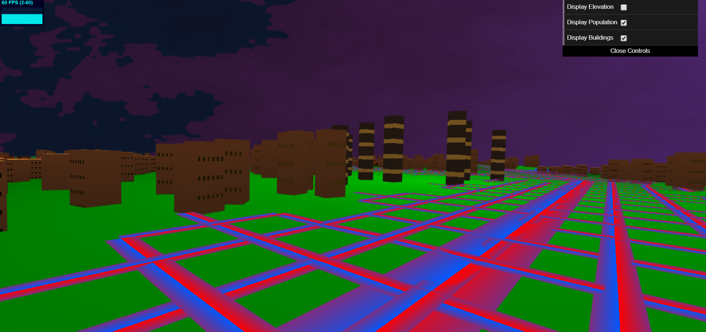
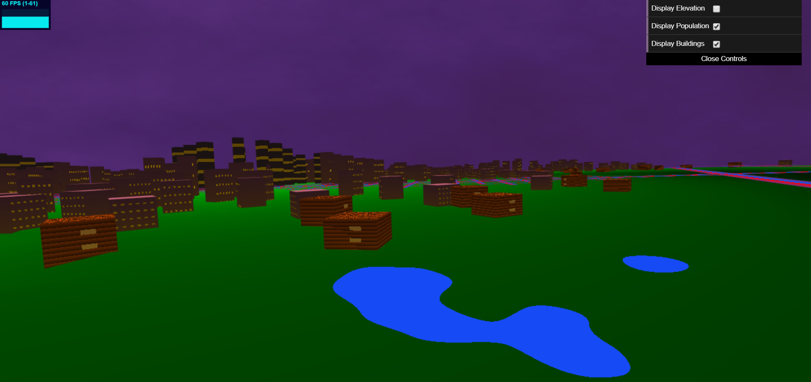

# Homework 6: City Generation

## Erin Goldberg
pennKey: engold

Link: https://engold.github.io/hw06-city-generation/
You need to zoom out when you first start because sometimes it starts up inside a building.

## References
- Class slides for noise
- FBM from //https://thebookofshaders.com/13/ and Adam's lecture Slides
- Mix function/lerp implementation https://www.khronos.org/registry/OpenGL-Refpages/gl4/html/mix.xhtml
- Intersection of two lines https://stackoverflow.com/questions/563198/how-do-you-detect-where-two-line-segments-intersect
- Writing to a texture buffer http://www.opengl-tutorial.org/intermediate-tutorials/tutorial-14-render-to-texture/
- LSystem Lecture Slides: https://cis700-procedural-graphics.github.io/files/lsystems_1_31_17.pd
- Procedural Modeling of Cities PDF

## Features
- 3D Terrain made out of a subdivided plane. Areas with water have a slightly lower elevation than grassy areas.

- Roads were rendered using instance rendered squares drawn just above the ground plane. They were colored split down the middle with red and blue to give the appearance of two lanes on the road, one with blue head lights and the other with red brake lights. 

- A city grid was made to determine valid placement of buildings. Using information from my texture about what is where on the map, the grid is able to determine which cells are possible spaces for buildings to be placed and which spaces already have water or a road placed there.

- To place buildings, I generated 450 possible spots and actually only put a building on that spot if it was a free space not already occupied by something else.

- To create the geometry of the buildings, I tried to follow the Real-Time Procedural Generation of 'Pseudo Infinite Cities' Paper, where a corner of the geometry (I used a cube) was extruded downward.

- Buildings are not uniform in appearance: Higher population areas (the center of the worley cells) have the tallest buildings and have the most buildings. These buildings are colored to look like skyscrapers, with big floor length windows. Spreading out from the tallest buildings, there are progressively shorter buildings. These buildings are made to look multi-story office buildings, having rows and rows of windows. The shortest buildings are made to look like little cabins, having layered log walls, a wooden textured roof, and a few windows.

- The tetxuring of the buildings is done procedurally and includes lights turning on an off.

- For lighting, several directional lights were used, which allows for buildings to be illumiated from all sides whithout leaving any pure black shadows.

- The sky background is done procedurally through the use of noise functions. I used a similar sky shader to the one I made for hw3 in my SDF environment scene. It is a purple, cloudy sky that matches the outdoorsy aesthics of my city.

